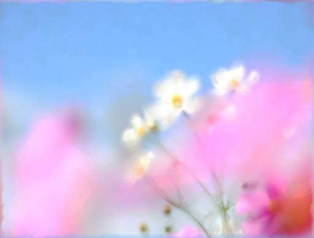

# shadertoy-collections

My shadertoy collection

## Painting Effects

</img>  

code: [```/painting-effects```](https://github.com/TLabAltoh/shadertoy-collections/tree/master/painting-effects)

## Getting Started
- Install [```ShaderToy```](https://marketplace.visualstudio.com/items?itemName=stevensona.shader-toy) in the [```VS Code```](https://azure.microsoft.com/en-us/products/visual-studio-code)
- Read "Before the run" section and follow any additional preparations.
- Press ```Ctrl``` + ```Shift``` + ```P``` and select ```Shader Toy: Show GLSL Preview```
